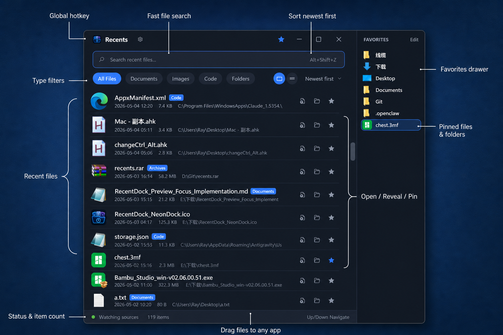

# Recents

[](#requirements)
[](#development)
[](#technology)
[](#privacy)

**Recents is a lightweight Windows launcher for people who work with files all day.**

Press a global hotkey, find the file you just saved, downloaded, edited, or opened, then drag it into another app, open it, reveal it in Explorer, pin it, or preview it with the keyboard.

[中文](#recents-中文)

## Screenshot

<p align="center">
  
</p>

## Why Recents?

Windows remembers files in several different places, but the result is scattered: Recent Items, Office MRU, Open/Save dialogs, Downloads, Desktop, Documents, network folders, and app-specific working directories all tell only part of the story.

Recents builds a local, multi-source recent-file index so the thing you just touched is close at hand. It is inspired by the same file-first workflow niche as macOS tools like Trickster: fast access to recent files, keyboard navigation, folder filters, and fewer trips through Explorer.

## Features

| Capability | What it does |
| --- | --- |
| **Global hotkey** | Show or hide Recents from anywhere. Default: `Alt+Shift+Z`, with fallback hotkeys when occupied. |
| **Real file paths** | Resolves `.lnk` shortcuts and passes original paths when opening, revealing, copying, or dragging. |
| **Drag to share** | Drag one or more files into WeChat, Lark, mail clients, browsers, upload forms, Explorer, and other Windows apps. |
| **Multi-source index** | Watches known folders, custom folders, UNC/network paths, Windows Recent Items, Office MRU, and Open/Save dialog MRU. |
| **Fast search and filters** | Filter by name, extension, path, and file groups such as Documents, Images, Code, and Folders. |
| **Favorites drawer** | Pin files or folders into a persistent right-side drawer, reorder them, and keep frequent handoff targets nearby. |
| **Quick preview** | Press `Space` to preview supported files with WebView2: PDF, images, text, CSV, code, Markdown, audio, and video. |
| **Tray resident** | Runs as a single-instance tray app, with optional launch at startup, start minimized, always-on-top, and hide-on-focus-lost behavior. |
| **Privacy-first** | Stores settings, logs, icon cache, and SQLite index locally. It does not upload files or delete original files. |

## Everyday Flow

1. Press `Alt+Shift+Z`.
2. Type part of a filename, extension, or folder path.
3. Use `Up` / `Down` to select.
4. Press `Enter` to open, `Space` to preview, or drag the file into another app.
5. Press `Esc` to hide Recents.

## Data Sources

Recents combines live file-system watchers with system MRU sources:

| Source | Purpose |
| --- | --- |
| Known folders | Downloads, Desktop, Documents, Pictures, Videos, and Music. |
| Custom local folders | Any folder you add in Settings. |
| UNC/network paths | Network shares such as `\\server\share\project`. Unavailable sources are marked unknown without blocking the UI. |
| Windows Recent Items | Resolves `.lnk` entries under the Windows Recent folder back to original targets. |
| Office MRU | Reads Microsoft Office recent-file records from the current user registry hive. |
| Open/Save dialog MRU | Reads Explorer common-dialog MRU entries and decodes PIDL paths where possible. |

## What Recents Is Not

Recents is intentionally small and local. It is not a file manager, cloud drive, full-text search engine, automation platform, sync service, or account-based product. Cloud folders can be added as normal local folders if they are mounted on disk, but Recents does not trigger cloud-only downloads or perform vendor-specific cloud integration.

## Requirements

- Windows 10 1903 or later, or Windows 11
- x64
- .NET 8 Desktop Runtime or a newer compatible .NET runtime
- Microsoft Edge WebView2 Runtime for quick preview

## Development

```powershell
git clone https://github.com/phoenixray2000/recents.git
cd recents
dotnet restore Recents.sln
dotnet build Recents.sln -c Release --no-restore
dotnet publish src\Recents.App\Recents.App.csproj -c Release --no-restore -o publish
```

Run the published app:

```powershell
.\publish\Recents.exe
```

For normal validation after packages are already restored:

```powershell
dotnet build Recents.sln --no-restore
```

## Technology

- C# / .NET 8+ with `RollForward=Major`
- WPF desktop UI, no Electron/Tauri/WebView shell for the main window
- Windows Forms `NotifyIcon` for tray residency
- Win32 `RegisterHotKey` for the global hotkey
- `FileSystemWatcher` for folder monitoring
- SQLite for the local recent-file index
- JSON settings under the user profile
- WebView2 for quick preview rendering

## Privacy

Recents is local-first:

- No login
- No cloud sync
- No telemetry pipeline
- No upload of your files
- No deletion of original files
- Settings and index data stay under your Windows user profile

Verbose logs are optional. By default, logging is designed to avoid exposing full paths unnecessarily.

## Project Status

Recents is under active development. The current focus is a practical Windows workflow: quickly retrieve, preview, drag, and open real recent files from multiple local sources.

## License

Licensed under the [Apache License 2.0](LICENSE).

---

# Recents 中文

[](#系统要求)
[](#开发)
[](#技术栈)
[](#隐私)

**Recents 是一个面向 Windows 重度文件工作流的轻量最近文件启动器。**

按下全局快捷键，快速找到刚保存、下载、编辑或打开过的真实文件，然后拖到其他应用、打开、定位到 Explorer、固定收藏，或直接用键盘预览。

[English](#recents)

## 截图

<p align="center">
  
</p>

## 为什么做 Recents？

Windows 其实记录了很多最近文件，但它们分散在不同位置：Recent Items、Office MRU、打开/保存对话框记录、下载目录、桌面、文档、网络共享盘，以及用户自己的工作目录。单看任何一个来源，都不完整。

Recents 会在本机建立一个多来源最近文件索引，让「刚才处理过的文件」始终离你更近。它参考了 macOS 上 Trickster 这类文件优先工具的工作流：快速访问最近文件、键盘导航、目录过滤，以及尽量少打开 Explorer 翻路径。

## 功能

| 能力 | 说明 |
| --- | --- |
| **全局快捷键** | 在任何地方呼出或隐藏 Recents。默认 `Alt+Shift+Z`，被占用时会尝试候选热键。 |
| **真实文件路径** | 解析 `.lnk` 快捷方式，打开、定位、复制、拖拽时都作用于原始文件路径。 |
| **拖拽分享** | 可把一个或多个文件拖到微信、飞书、邮件、浏览器上传框、Explorer 和其他 Windows 应用。 |
| **多来源索引** | 监听已知文件夹、自定义目录、UNC 网络路径，并读取 Windows Recent Items、Office MRU、打开/保存对话框 MRU。 |
| **快速搜索与筛选** | 按文件名、扩展名、路径搜索，并按 Documents、Images、Code、Folders 等类型筛选。 |
| **收藏抽屉** | 将常用文件或文件夹固定到右侧持久收藏抽屉，支持排序和快速访问。 |
| **空格预览** | 按 `Space` 预览支持的文件：PDF、图片、文本、CSV、代码、Markdown、音频、视频。 |
| **常驻托盘** | 单实例托盘应用，支持开机自启、启动最小化、置顶、失焦隐藏、关闭到托盘等行为。 |
| **隐私优先** | 设置、日志、图标缓存和 SQLite 索引都保存在本机；不上传文件，也不删除原始文件。 |

## 日常使用

1. 按 `Alt+Shift+Z`。
2. 输入文件名、扩展名或路径片段。
3. 用 `Up` / `Down` 选择。
4. 按 `Enter` 打开，按 `Space` 预览，或直接拖到其他应用。
5. 按 `Esc` 隐藏窗口。

## 数据来源

Recents 会组合文件系统监听和系统 MRU 数据：

| 来源 | 用途 |
| --- | --- |
| 已知文件夹 | Downloads、Desktop、Documents、Pictures、Videos、Music。 |
| 自定义本地目录 | 在设置里手动添加的任意目录。 |
| UNC / 网络路径 | 例如 `\\server\share\project`。网络不可用时标记为 unknown，不阻塞界面。 |
| Windows Recent Items | 读取 Windows Recent 文件夹里的 `.lnk`，并解析回原始目标路径。 |
| Office MRU | 从当前用户注册表读取 Microsoft Office 最近文件记录。 |
| 打开/保存对话框 MRU | 读取 Explorer 通用对话框 MRU，并尽量解析 PIDL 路径。 |

## Recents 不做什么

Recents 有意保持小而本地化。它不是文件管理器、云盘、全文搜索引擎、自动化平台、同步服务，也不是需要账号登录的产品。已挂载到本地的云盘目录可以作为普通目录添加，但 Recents 不会触发 cloud-only 文件下载，也不做厂商特定的云盘集成。

## 系统要求

- Windows 10 1903 或更新版本，或 Windows 11
- x64
- .NET 8 Desktop Runtime 或更高兼容版本
- Microsoft Edge WebView2 Runtime，用于空格预览

## 开发

```powershell
git clone https://github.com/phoenixray2000/recents.git
cd recents
dotnet restore Recents.sln
dotnet build Recents.sln -c Release --no-restore
dotnet publish src\Recents.App\Recents.App.csproj -c Release --no-restore -o publish
```

运行发布产物：

```powershell
.\publish\Recents.exe
```

依赖已经还原后，日常验证命令：

```powershell
dotnet build Recents.sln --no-restore
```

## 技术栈

- C# / .NET 8+，运行时允许 `RollForward=Major`
- WPF 桌面 UI，主窗口不使用 Electron、Tauri 或 WebView 外壳
- Windows Forms `NotifyIcon` 实现托盘常驻
- Win32 `RegisterHotKey` 实现全局快捷键
- `FileSystemWatcher` 实现目录监听
- SQLite 保存本地最近文件索引
- JSON 保存用户配置
- WebView2 用于快速预览渲染

## 隐私

Recents 是本地优先的桌面工具：

- 无登录
- 无云同步
- 无遥测管线
- 不上传你的文件
- 不删除原始文件
- 设置与索引数据保存在你的 Windows 用户目录下

详细日志是可选项。默认日志策略会尽量避免不必要地暴露完整路径。

## 项目状态

Recents 正在持续开发中。当前目标很明确：在 Windows 上快速找回、预览、拖拽和打开来自多个本地来源的真实最近文件。

## 许可证

本项目使用 [Apache License 2.0](LICENSE) 许可协议。
