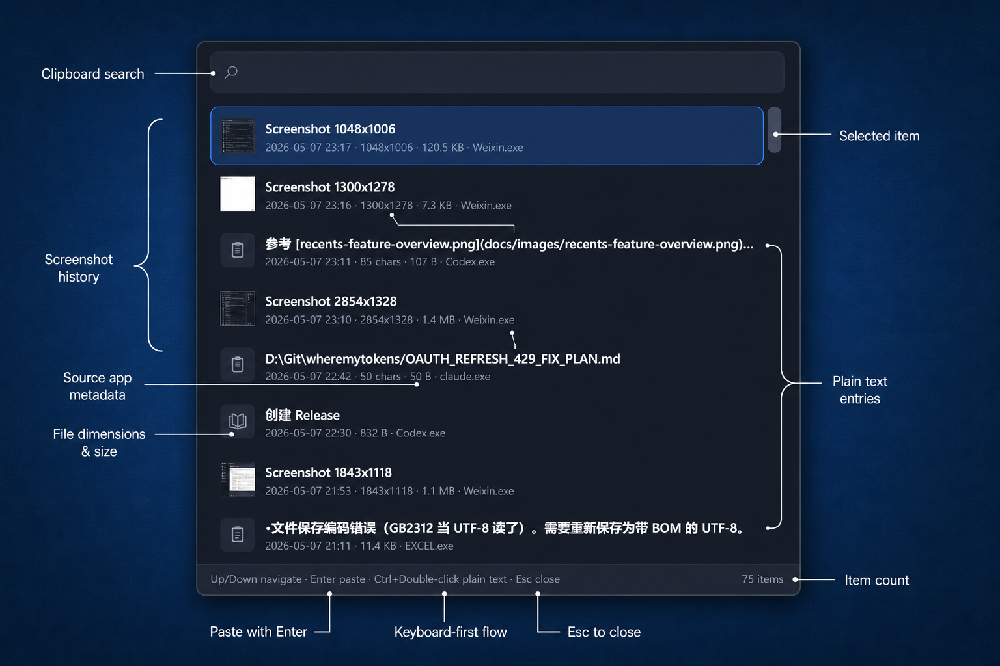
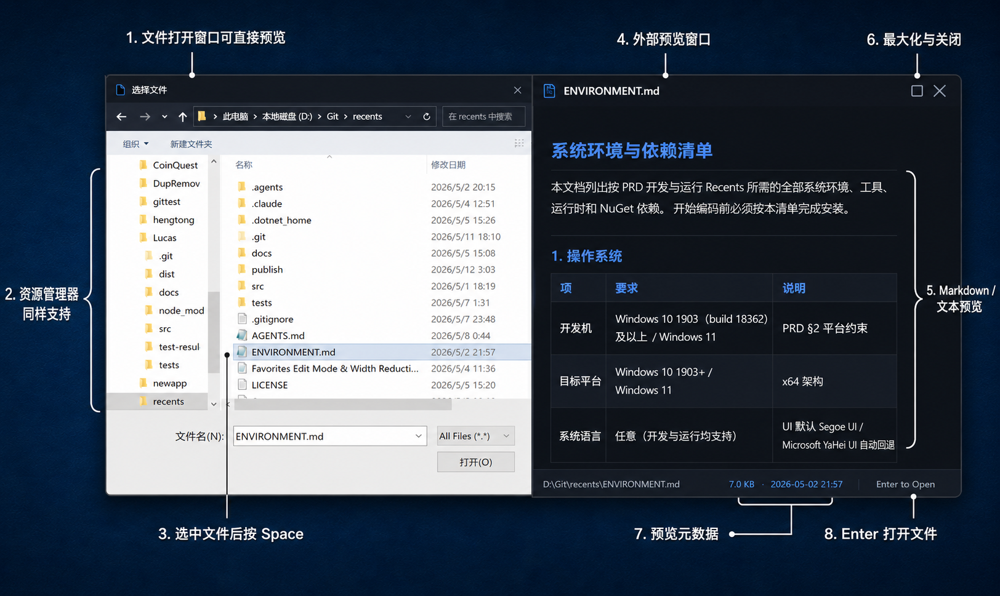

# Recents

[](#系统要求)
[](#开发)
[](LICENSE)

**Recents 是一个 Windows 最近文件、文件夹、剪贴板历史与跨设备同步工具。**

你刚下载的文件、刚保存的文档、刚复制的文字、刚截图的图片，都可以在一个窗口里找回、搜索、预览、拖走或粘贴。

当前版本：**1.3.1**

[English](#recents-english)

---

## 截图

### 主窗口与快速预览

<p align="center">
  
</p>

### 剪贴板历史与跨设备同步

<p align="center">
  
</p>

### 外部 Space 预览

<p align="center">
  
</p>

---

## 为什么需要 Recents

Windows 里“刚刚用过的东西”分散在很多地方：

- 下载目录里有刚下的文件
- 桌面和文档里有刚保存的文件
- Office 里有最近打开的文档
- Windows Recent Items 里有一堆快捷方式
- 剪贴板里有刚复制过的文字、图片和文件
- 需要手机和电脑之间剪贴板快速同步
- 微信、飞书、浏览器、邮件、表单经常需要你把这些东西再拖进去

系统自带功能能用，但不够顺手。你经常需要打开资源管理器、翻目录、搜文件名、回想保存路径，或者复制内容被下一次复制覆盖后再也找不到。

Recents 解决的是这个问题：**把最近用过的文件和剪贴板内容集中到一个快速窗口里，方便你马上复用。**

---

## 适合这些场景

| 场景 | Recents 怎么帮你 |
| --- | --- |
| 刚下载一个文件，要发到微信/飞书 | 呼出 Recents，直接把文件拖到聊天窗口 |
| 刚保存一份合同、表格或图片 | 搜文件名或扩展名，按 Enter 打开，或拖到其他应用 |
| 忘了文件保存在哪 | 右键 Reveal in Explorer，直接定位到文件夹 |
| 刚复制过一段文字，但被新内容覆盖 | 打开 Clipboard，搜索历史内容，复制或粘贴回去 |
| 刚复制过图片或截图 | 在 Clipboard 里找回，复制、预览，或作为图片文件拖出去 |
| 想在 Windows 和手机之间同步当前剪贴板 | 开启 WebDAV 同步，和兼容 SyncClipboard 的其他客户端共用同一个同步目录 |
| iPhone 上复制了文字、图片或验证码 | 通过 iOS 快捷指令同步到 WebDAV，Recents 在 Windows 上拉取并写入系统剪贴板 |
| 经常用同几个文件/文件夹 | 加入 Favorites，长期固定在侧边栏 |
| 想快速预览，不想打开大软件 | 选中文件后按 Space 预览 |

---

## 核心功能

### 最近文件和文件夹

- 用快捷键呼出主窗口
- 展示最近保存、下载、打开、复制或编辑过的文件
- 支持最近文件夹
- 搜索文件名、扩展名和路径
- 按文档、图片、文件夹、剪贴板等类型筛选
- 双击打开文件
- 文件夹已打开时，优先切换到已有 Explorer 窗口
- 右键打开、定位、复制路径、打开方式、隐藏、收藏
- 拖拽真实文件路径到微信、飞书、浏览器、邮件、Explorer 或其他应用

Recents 会解析 Windows Recent 里的 `.lnk`，列表里显示和操作的是原始文件，不是快捷方式本身。

### 剪贴板历史与跨设备同步

Clipboard History 和 WebDAV 同步默认关闭，可以在设置里分别开启。

开启后可记录：

- 文本
- 文件和文件夹
- 图片
- HTML
- 富文本

你可以：

- 搜索历史剪贴内容
- 双击复制回剪贴板
- 用 Pop Paste 快速粘贴到当前应用
- 把文件类剪贴板条目拖到其他应用
- 把图片当作图片文件拖出去
- 把常用剪贴内容加入 Favorites
- 删除单条或清空历史

### 剪贴板 WebDAV 同步 v1.3新增

Clipboard WebDAV 同步兼容 [Jeric-X/SyncClipboard](https://github.com/Jeric-X/SyncClipboard)。主要原因是近期 SyncClipboard 在我的使用场景里不太稳定、偶尔卡死，所以把当前剪贴板同步能力集成进 Recents，顺便减少一个常驻程序的系统开销。感谢 SyncClipboard 作者提供原项目和同步协议。

WebDAV 同步默认关闭。开启后，Recents 只同步“当前最新剪贴板”，不同步完整剪贴板历史、Favorites 或最近文件列表。

同步方式：

- 本机复制文字、图片或文件后，Recents 会把当前剪贴板写入 WebDAV 工作目录中的 `SyncClipboard.json`，必要的载荷文件放在 `file/` 子目录。
- WebDAV 远端剪贴板变化后，Recents 会拉取 `SyncClipboard.json` 和对应载荷，并写入 Windows 系统剪贴板。
- 文本、图片、单文件、多文件/文件夹 zip 载荷尽量按 SyncClipboard 语义处理。
- 普通图片会保留原格式；HEIC/HEIF/WebP/AVIF 等复杂图片会按 SyncClipboard 兼容策略转换为 JPG 或 GIF，便于直接粘贴到支持图片的文本框。

服务器和其他客户端：

- 目前 Recents 只支持 WebDAV 服务器作为剪贴板同步后端。可以使用支持 WebDAV 协议的网盘或自建服务作为服务器。
- 参考 SyncClipboard 原作者 README，测试过的 WebDAV 服务器包括：
  - [Nextcloud](https://nextcloud.com/)
  - [AList](https://alist.nn.ci/)
  - [InfiniCLOUD](https://infini-cloud.net/en/)
  - [aliyundrive-webdav](https://github.com/messense/aliyundrive-webdav)
- 其他平台可以继续使用 SyncClipboard 客户端，和 Recents 共用同一个 WebDAV 工作目录。
- iOS 端可以通过快捷指令同步：
  - 手动同步：导入这个[快捷指令](https://www.icloud.com/shortcuts/34404963b512432cb5672c8a95001b19)，手动触发上传或下载剪贴板内容。
  - 自动同步：导入这个[快捷指令](https://www.icloud.com/shortcuts/05e7ac5aca5f4f588b776117cf740587)，运行后设备会自动在后台同步剪贴板内容。此快捷指令会无限时长运行，需要手动关闭；也可以自行修改同步后是否发送系统通知、查询间隔秒数等参数。
  - 自动上传短信验证码：参考 SyncClipboard 讨论区 [#60](https://github.com/Jeric-X/SyncClipboard/discussions/60) 中的视频教程。

### Pop Paste v1.1新增

Pop Paste 是一个小弹窗，用于快速找回并粘贴剪贴板历史。

典型用法：

1. 在任意应用里按 Pop Paste 快捷键
2. 输入关键词搜索历史剪贴内容
3. 选择条目
4. 复制或直接粘贴到当前应用

它不会占用 Windows 自带的 `Win + V`。

### Favorites

Favorites 用来长期保留常用内容。

支持收藏：

- 文件
- 文件夹
- 文本剪贴板
- 图片剪贴板
- HTML / 富文本剪贴板

Favorites 支持：

- 分组
- 排序
- 别名
- 拖拽加入
- 拖拽到外部应用

别名只改变 Recents 里的显示名称，不改真实文件名或剪贴板内容。

### Quick Preview

选中文件或剪贴板条目后按 `Space` 预览。

支持：

- 图片
- PDF
- 文本
- 代码
- Markdown
- CSV
- HTML
- 音频
- 视频
- Word / Excel / PowerPoint / RTF
- 文件夹摘要

不支持、过大、缺失或无权限访问的内容会显示明确提示，不会卡住主窗口。

启用外部 Space 预览后，Recents 也可以在 Explorer、桌面和现代文件打开/保存窗口中预览当前选中的文件。 v1.2新增

---

## 数据来源

Recents 会整合多个本机来源：

| 来源 | 说明 |
| --- | --- |
| 常用文件夹 | Downloads、Desktop、Documents、Pictures、Videos、Music |
| 自定义目录 | 用户在设置中添加的本地目录 |
| 网络路径 | 用户添加的 UNC / 网络共享路径 |
| Windows Recent Items | 解析 Windows 最近项目里的 `.lnk` |
| Office 最近文件 | 读取当前用户的 Office 最近文件记录 |
| 打开/保存对话框记录 | 尽量读取系统对话框里的最近路径 |
| 剪贴板历史与跨设备同步 | 用户开启后，本地保存剪贴板记录 |
| WebDAV 当前剪贴板 | 用户显式开启后，读取和写入配置的 WebDAV 工作目录 |

---

## 隐私

Recents 默认按本地工具设计：

- 不需要账号
- 默认不做云同步
- 默认不上传文件
- 默认不上传剪贴板内容
- 仅当用户显式开启 WebDAV 同步时，才会把当前最新剪贴板写入用户配置的 WebDAV 工作目录
- WebDAV 同步只同步当前最新剪贴板，不上传完整剪贴板历史、Favorites、最近文件或最近文件夹
- 不删除原始文件
- 剪贴板历史和 WebDAV 同步默认关闭
- 敏感剪贴板内容默认过滤
- 密码管理器来源默认过滤
- 设置、索引、缓存、日志和剪贴板数据都保存在本机用户目录

你可以在设置里清空剪贴板历史、清理缓存、暂停剪贴板记录。

---

## Recents 不是什么

Recents 不是：

- 云盘
- 文件管理器
- 全文搜索引擎
- 完整历史 / 文件同步服务
- 自动化平台
- 浏览器历史读取器
- 聊天记录读取器

如果 OneDrive、Google Drive、SharePoint 等云盘已经挂载成本地目录，Recents 可以像普通文件夹一样监听它们。但 Recents 不会调用云盘 API，也不会主动触发 cloud-only 文件下载。

---

## 系统要求

- Windows 10 1903 或更新版本
- Windows 11
- x64
- WebView2 Runtime（用于文本、图片、PDF 等 WebView2 预览）
- framework-dependent 版本需要 .NET 8 Desktop Runtime 或兼容版本
- self-contained 版本包含 .NET runtime，体积更大

---

## 下载

从 [GitHub Releases](https://github.com/phoenixray2000/recents/releases) 下载。

发布包通常有两种：

| 版本 | 适合谁 |
| --- | --- |
| framework-dependent | 体积小，适合已安装 .NET Desktop Runtime 的电脑 |
| self-contained | 体积大，适合不想单独安装 .NET Runtime 的电脑 |

---

## 开发

```powershell
git clone https://github.com/phoenixray2000/recents.git
cd recents
dotnet restore Recents.sln
dotnet build Recents.sln -c Release --no-restore
dotnet publish src\Recents.App\Recents.App.csproj -c Release --no-restore -o publish
```

运行：

```powershell
.\publish\Recents.exe
```

日常验证：

```powershell
dotnet build Recents.sln --no-restore
```

---

## 许可证

本项目使用 [Apache License 2.0](LICENSE)。

---

# Recents English

[](#requirements)
[](#development-1)
[](LICENSE)

**Recents is a Windows app for recent files, folders, clipboard history, and cross-device clipboard sync.**

The file you just downloaded, the document you just saved, the text you just copied, and the screenshot you just took can all be found, searched, previewed, dragged, or pasted from one place.

Current version: **1.3.1**

[中文](#recents)

---

## Screenshots

### Main Window and Quick Preview

<p align="center">
  
</p>

### Clipboard History and Cross-Device Sync

<p align="center">
  
</p>

### External Space Preview

<p align="center">
  
</p>

---

## Why Recents

The things you just worked with are scattered across Windows:

- Downloads has the file you just downloaded
- Desktop and Documents have files you just saved
- Office keeps its own recent documents
- Windows Recent Items contains shortcut files
- The clipboard has copied text, images, files, HTML, and rich text
- You need fast clipboard sync between your phone and PC
- Chat apps, browsers, email, upload forms, and internal tools often need those items again

Built-in tools help, but they are not smooth enough for daily handoff work. You still need to open Explorer, remember where the file was saved, search by name, or lose clipboard content after copying something else.

Recents solves one simple problem: **bring recently used files and clipboard items into one fast window so you can reuse them immediately.**

---

## Common Use Cases

| Use case | How Recents helps |
| --- | --- |
| You downloaded a file and need to send it in chat | Open Recents and drag the file into the chat window |
| You just saved a contract, spreadsheet, or image | Search by name or extension, then open it or drag it out |
| You forgot where a file was saved | Use Reveal in Explorer to jump to its folder |
| You copied text but overwrote it later | Search Clipboard history and copy or paste it again |
| You copied an image or screenshot | Find it in Clipboard, preview it, copy it, or drag it as an image file |
| You need clipboard sync between Windows and your phone | Enable WebDAV sync and share one sync folder with SyncClipboard-compatible clients |
| You copied text, an image, or a verification code on iPhone | Use iOS Shortcuts to sync through WebDAV, then Recents pulls it into the Windows clipboard |
| You use the same files or folders often | Add them to Favorites |
| You want to check a file without opening a full app | Press Space for Quick Preview |

---

## Features

### 1.2 Key Updates

- Quick Preview supports common Office files: Word, Excel, PowerPoint, and RTF use the system Shell Preview Handler.
- Press `Space` to preview a selected file in Explorer, the desktop, and modern Open/Save file dialogs.
- Third-party file managers can call `Recents.exe --preview "<path>"` to open a preview directly.
- Audio and video preview use native Windows playback with play/pause, stop, progress display, and seeking.
- The preview window supports maximize, title-bar double-click maximize, and stays above the main window.
- Text and Markdown preview follow the current Recents light/dark theme.

### Recent Files and Folders

- Show the main window with a global hotkey
- List files you recently saved, downloaded, opened, copied, or edited
- Include recent folders
- Search by filename, extension, or path
- Filter by documents, images, folders, clipboard, and more
- Double-click to open files
- Activate an existing Explorer window when a folder is already open
- Right-click to open, reveal, copy path, open with, hide, or favorite
- Drag real file paths into chat apps, browsers, mail clients, Explorer, upload forms, and other apps

Recents resolves `.lnk` shortcuts from Windows Recent Items and works with the original target file, not the shortcut itself.

### Clipboard History and Cross-Device Sync

Clipboard History and WebDAV sync are off by default. You can enable them separately in Settings.

When enabled, it can save:

- Text
- Files and folders
- Images
- HTML
- Rich text

You can:

- Search clipboard history
- Double-click to copy an item back to the clipboard
- Use Pop Paste to paste into the active app
- Drag file-based clipboard items into other apps
- Drag images as image files
- Add useful clipboard items to Favorites
- Delete individual items or clear all history

### Clipboard WebDAV Sync

Clipboard WebDAV sync is compatible with [Jeric-X/SyncClipboard](https://github.com/Jeric-X/SyncClipboard). It is integrated into Recents because SyncClipboard has recently been unstable for my workflow and can hang, while a built-in path also saves some system overhead. Thanks to the SyncClipboard author for the original project and protocol.

WebDAV sync is off by default. When enabled, Recents only syncs the current latest clipboard item. It does not sync full clipboard history, Favorites, recent files, or recent folders.

How it works:

- After you copy text, an image, or a file on Windows, Recents writes the current clipboard item to `SyncClipboard.json` in the WebDAV working directory, with payload files under `file/` when needed.
- When the remote WebDAV clipboard changes, Recents downloads `SyncClipboard.json` and the referenced payload, then writes it into the Windows system clipboard.
- Text, images, single files, and multi-file/folder zip payloads follow SyncClipboard semantics where possible.
- Standard images keep their original format. HEIC/HEIF/WebP/AVIF and other complex images are converted to JPG or GIF for compatibility with normal paste targets.

Servers and other clients:

- Recents currently supports WebDAV servers for clipboard sync. Any storage service that exposes the WebDAV protocol may work.
- Tested WebDAV servers from the SyncClipboard README:
  - [Nextcloud](https://nextcloud.com/)
  - [AList](https://alist.nn.ci/)
  - [InfiniCLOUD](https://infini-cloud.net/en/)
  - [aliyundrive-webdav](https://github.com/messense/aliyundrive-webdav)
- Other platforms can continue to use SyncClipboard clients with the same WebDAV folder.
- On iOS, clipboard sync can be done with Shortcuts:
  - Manual sync: import this [shortcut](https://www.icloud.com/shortcuts/34404963b512432cb5672c8a95001b19) and run it manually to upload or download clipboard content.
  - Automatic sync: import this [shortcut](https://www.icloud.com/shortcuts/05e7ac5aca5f4f588b776117cf740587) and run it to keep syncing the clipboard in the background. This shortcut runs indefinitely until you stop it manually. You can edit whether it sends system notifications after syncing and how many seconds it waits between checks.
  - Automatic SMS verification-code upload: see the video tutorial in [SyncClipboard discussion #60](https://github.com/Jeric-X/SyncClipboard/discussions/60).

### Pop Paste

Pop Paste is a small picker for quickly reusing clipboard history.

Typical flow:

1. Press the Pop Paste hotkey from any app
2. Type to search clipboard history
3. Pick an item
4. Copy it or paste it into the current app

It does not replace the built-in Windows `Win + V`.

### Favorites

Favorites keep important items available for long-term reuse.

You can favorite:

- Files
- Folders
- Text clipboard items
- Image clipboard items
- HTML / rich text clipboard items

Favorites support:

- Groups
- Reordering
- Aliases
- Dragging items in
- Dragging items out to other apps

Aliases only change the display name inside Recents. They do not rename files or modify clipboard content.

### Quick Preview

Select an item and press `Space` to preview it.

Supported content includes:

- Images
- PDF
- Text
- Code
- Markdown
- CSV
- HTML
- Audio
- Video
- Word / Excel / PowerPoint / RTF
- Folder summary

Unsupported, too-large, missing, or inaccessible items show a clear state instead of blocking the main window.

When external Space preview is enabled, Recents can also preview the selected file from Explorer, the desktop, and modern Open/Save dialogs.

---

## Data Sources

Recents combines several local sources:

| Source | What it does |
| --- | --- |
| Known folders | Downloads, Desktop, Documents, Pictures, Videos, Music |
| Custom folders | Local folders added in Settings |
| Network paths | UNC / network shares added by the user |
| Windows Recent Items | Resolves `.lnk` files from Windows Recent Items |
| Office recent files | Reads current-user Office recent document records |
| Open/Save dialog history | Tries to read recent paths from common file dialogs |
| Clipboard history and cross-device sync | Stores clipboard records locally when enabled |
| WebDAV current clipboard | Reads and writes the configured WebDAV working directory when explicitly enabled |

---

## Privacy

Recents is designed as a local desktop tool:

- No account
- No cloud sync by default
- No file uploads by default
- No clipboard uploads by default
- Only when WebDAV sync is explicitly enabled does Recents write the current clipboard item to the configured WebDAV working directory
- WebDAV sync only syncs the current latest clipboard item; it does not upload full clipboard history, Favorites, recent files, or recent folders
- No deletion of original files
- Clipboard History and WebDAV sync are off by default
- Sensitive clipboard text is filtered by default
- Password-manager sources are filtered by default
- Settings, indexes, caches, logs, and clipboard data stay under your Windows user profile

You can clear clipboard history, clean caches, or pause clipboard capture from Settings.

---

## What Recents Is Not

Recents is not:

- A cloud drive
- A file manager
- A full-text search engine
- A full history or file sync service
- An automation platform
- A browser history reader
- A chat history reader

If OneDrive, Google Drive, SharePoint, or another cloud drive is mounted as a local folder, Recents can watch it like a normal folder. It does not call cloud APIs or trigger cloud-only downloads.

---

## Requirements

- Windows 10 1903 or later
- Windows 11
- x64
- WebView2 Runtime for WebView2-backed previews such as text, images, and PDF
- The framework-dependent build requires .NET 8 Desktop Runtime or a compatible runtime
- The self-contained build includes the .NET runtime and is larger

---

## Download

Download from [GitHub Releases](https://github.com/phoenixray2000/recents/releases).

| Build | Best for |
| --- | --- |
| framework-dependent | Smaller package, requires .NET Desktop Runtime |
| self-contained | Larger package, no separate .NET Runtime install needed |

---

## Development

```powershell
git clone https://github.com/phoenixray2000/recents.git
cd recents
dotnet restore Recents.sln
dotnet build Recents.sln -c Release --no-restore
dotnet publish src\Recents.App\Recents.App.csproj -c Release --no-restore -o publish
```

Run:

```powershell
.\publish\Recents.exe
```

For routine validation:

```powershell
dotnet build Recents.sln --no-restore
```

---

## License

Licensed under the [Apache License 2.0](LICENSE).
